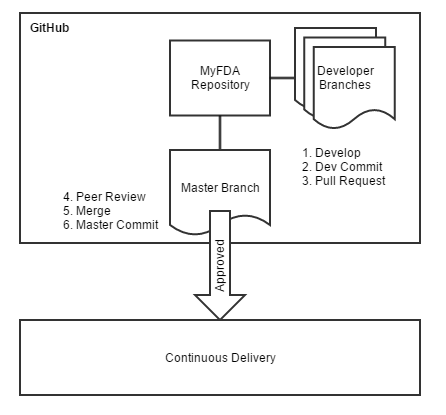
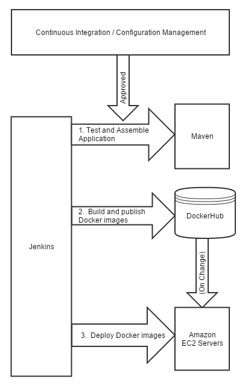
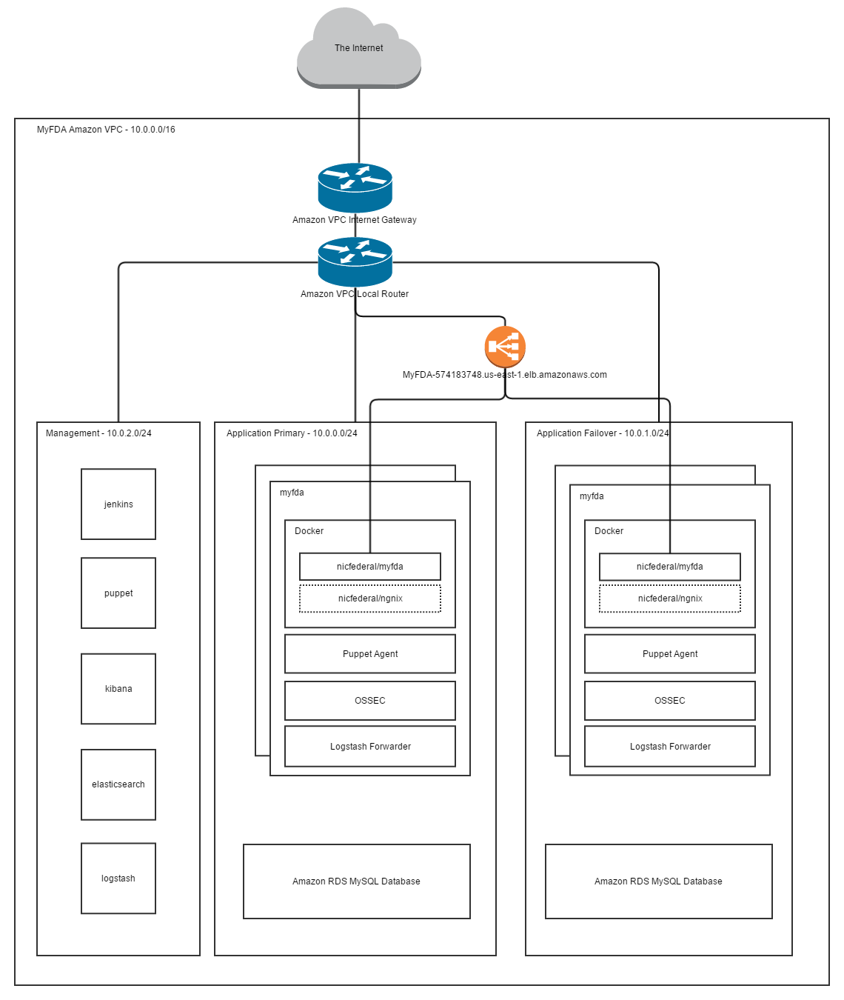

[Return to Documentation Index](README.md)

DevOps
======

Describes the DevOps techniques applied to the prototype project to provide continuous integration, 
deployment, and monitoring.  Additionally, configuration management is discussed and the cloud 
architecture is shown.

Overview
--------

Continuous Integration, Deployment, and Monitoring are closely related disciplines which required the team 
to establish a repeatable pipeline which could be executed in an automated fashion with minimal disruption 
to the teams workflow.  To do this the team used a combination of open source and freely available tools 
and services.  At the heart of this deployment pipeline is the Jenkins CI, Apache Maven, Docker and 
GitHub.  Jenkins is configured to monitor the main GitHub repository for changes.  When changes are 
detected the project work space is updated to reflect these changes.  Then Jenkins executes Apache Maven 
to build the project artifacts.  Jenkins then packages these project as a runnable Docker image and pushes 
the image to DockerHub.  Finally Jenkins uses SSH to instruct the nodes in the production cluster to 
download and run the newest Docker image.

Continuous Integration
----------------------

Team members each created forks of the main repository on GitHub and then cloned these repositories to 
their local environments.  At the end of each day completed work was pushed to each developer's GitHub 
repository and a pull request was created to move this work into the main repository.  Once a pull request 
was approved the lead developer pulled these changes from the upstream repository and resolved any merge 
conflicts.  Once the software was built and tested in the lead developer's local repository and all tests 
were passed, the merge commit was pushed to the central GitHub repository and included in the developers 
pull request for the day.  At this point developers would pull all changes from the central upstream 
GitHub repository and build and test the application.  If any issues were discovered in a developers 
repository this process was repeated until all changes were successfully integrated into the central 
GitHub repository.  This process was repeated  at least once for each sprint until prototype design and 
development was complete.

  
*Image Caption:  The continuous integration architecture.*
 
Continuous Delivery
-------------------

The MyFDA application is configured to provide continuous delivery to the production environment.  
Whenever a pull request was approved the main repository is updated and the application is tested 
assembled and deployed immediately to a production environment.  This allows production to always reflect 
the most recently approved code.  If this prototype were to become the beginning of an actual production 
service, a staging environment would be inserted into the CD flow, so that additional automated and manual 
testing could be conducted prior to deployment of a new version to production.  To expedite development of 
the prototype, changes committed to the master branch were deployed directly to production.  The figure 
below details the steps in the continuous delivery pipeline.

  
*Image Caption:  The continuous delivery architecture.*
 
During step one the MyFDA application uses a Maven [pom.xml](https://github.com/NIC-Federal/myfda/blob/master/pom.xml) to detail all the necessary dependent projects 
needed to build the MyFDA application.  All Java dependences are present directly in the pom.xml file.  
However, the project is configured to delegate the responsibility of assembling the client ember 
application to the maven-frontend-plugin which uses npm and bower to declare the projects dependencies in 
the [package.json](https://github.com/NIC-Federal/myfda/blob/master/package.json) and [bower.json](https://github.com/NIC-Federal/myfda/blob/master/bower.json) files.  The output of this job is a Java executable jar file and the 
instructions for building a docker image that can run the application in the form of the file 
[docker-build.sh](https://github.com/NIC-Federal/myfda/blob/master/docker-build.sh).

The second job assembles the executable jar file into a docker image using the script docker-build.sh. 
This script uses the [Dockerfile](https://github.com/NIC-Federal/myfda/blob/master/Dockerfile) to create the docker image and pushes it to DockerHub.

The final job instructs a deployment environment to load the newly created images in the form of the 
[docker-deploy.sh](https://github.com/NIC-Federal/myfda/blob/master/docker-deploy.sh) script.  At this stage in the process you must provide configuration artifacts that 
should not be shared publicly such as API keys, database passwords and security certificates.  In 
production these artifacts are stored in a separate repository with strict access controls.  However, we 
have provided a sample configuration that contains all the files needed to complete this step with 
placeholders for the information that must be provided and self signed certificates and private keys not 
suitable for production use.  For more information on using the sample to create a final production 
configuration see the Configuration Guide.

| Step # | Job Configuration | Sample Job Log |
| :----- | :---------------- | :------------- |
1 | https://github.com/NIC-Federal/myfda/tree/master/jenkins/myfda https://github.com/NIC-Federal/myfda/blob/master/pom.xml https://github.com/NIC-Federal/myfda/blob/master/package.json https://github.com/NIC-Federal/myfda/blob/master/bower.json | [Sample Log File 1](DevOps/myfda-26-consoleText.txt) |
2 | https://github.com/NIC-Federal/myfda/tree/master/jenkins/myfda-docker https://github.com/NIC-Federal/myfda/blob/master/docker-build.sh https://github.com/NIC-Federal/myfda/blob/master/Dockerfile | [Sample Log File 2](DevOps/myfda-docker-28-consoleText.txt) |
3 | https://github.com/NIC-Federal/myfda/tree/master/jenkins/myfda-deploy https://github.com/NIC-Federal/myfda/blob/master/docker-deploy.sh | [Sample Log File 3](DevOps/myfda-deploy-15-consoleText.txt) |

Continuous Monitoring
---------------------

Since the delivery of the application is continuous, monitoring of the application must also be continuous 
to ensure that the CI process had not impacted availability and that the infrastructure is functioning as 
intended.  Four monitoring methods have been implemented to achieve our continuous monitoring objectives.  
The first type of monitoring is availability monitoring.  Pingdom is being used to perform this external 
availability monitoring.  The second type of monitoring is user behavior monitoring, and this is done 
using Google Analytics.  Google Analytics provides a real-time view of user activity so that abnormal 
usage patterns can be detected.  Finally, all logs are loaded into ElasticSearch using Logstash and are 
available for analysis via the Kibana visualization tool or by directly querying ElasticSearch  to detect 
and alert operations staff of anomalous activity,   For more information about continuous security 
monitoring, please consult the [Security](Security.md) section in the project documentation.

Configuration Management
------------------------

The MyFDA application uses the philosophy that configuration should be represented as code. This is 
reflected in the continuous delivery strategy adopted by the application.  All details of how to install 
and deploy a running system are present in a source code repository.  All configuration is part of the 
GitHub project other than secure configuration aspects like the security certificates and API keys which 
are stored in a private code repository. Therefore, all configuration is controlled by the source control 
system. Just like code, all configuration changes are inspected and peer reviewed before any configuration 
changes are accepted into the project.

Additionally, to assist with configuration management, configuration has been documented within the 
project documentation to improve understanding by those managing the operation of the application. Also, 
issues encountered during development were captured in JIRA and configuration changes required to address 
these issues were documented within the appropriate JIRA issue ticket.

Cloud Architecture
-----------------------------

The following diagram shows the AWS architecture used for hosting and managing the MyFDA prototype.

  
*Image Caption:  High-level cloud architecture diagram.*
