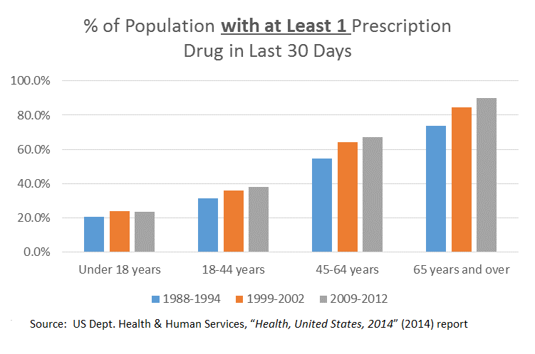
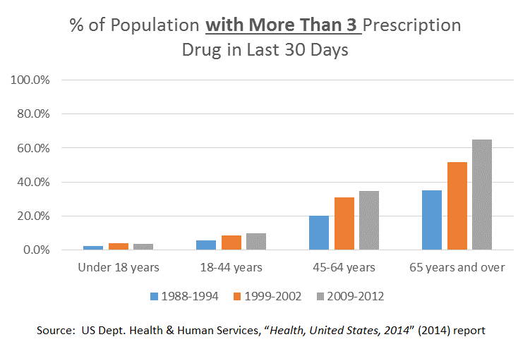
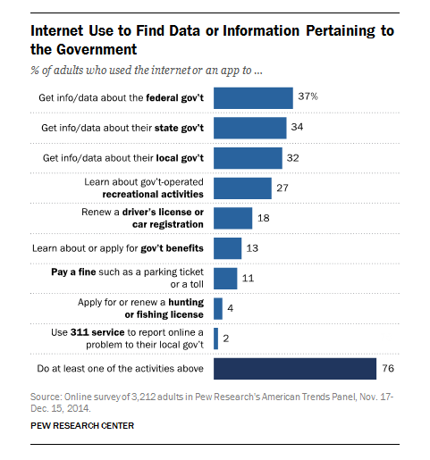
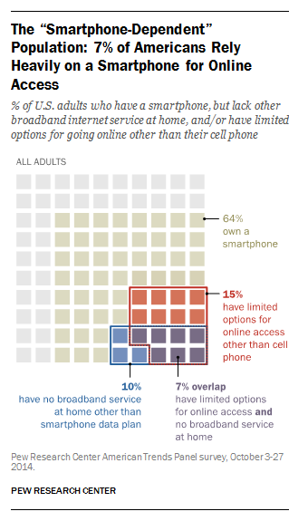
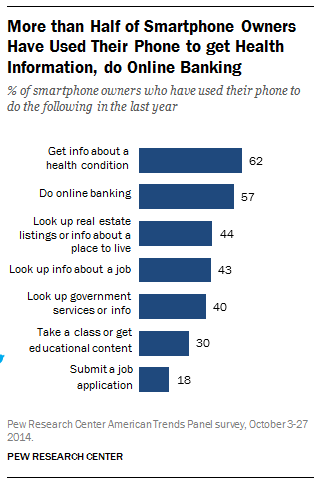

[Return to User-Centered Design](../User-Centered%20Design.md) | [Return to Documentation Index](../README.md)

User Research Results
=====================

Below is a summary of the information discovered during user research activities.

**Applicable U.S. Census Bureau data:**

| U.S. Census Bureau Measurement | Data | Potential # of Consumers of FDA data |
| :----------------------------- | :--- | :----------------------------------- |
| U.S. population | 318,857,056 | 318,857,056 |
| % of persons over 65 years | 14.1% | 44,958,844 |
| % of persons under 18 years | 23.3% | 74,293,694 |
| % of persons under 5 years | 6.3% | 20,087,994 |

  

  

  

